# 接口

推理业务：周学荣 00943888
RL训练业务：刘荣 00572936

# 使用指南

基于vllm-ascend main分支，开启--async-scheduling，使能异步调度

```shell

#!/bin/bashvllm serve /home/liurong/vllm-ascend/deepseek-mtp-test \
       --gpu-memory-utilization 0.95 \
       --max-num-seqs 24 \
       --max-model-len 1024 \
       --trust-remote-code \
       --served-model-name deepseek_v3 \
       --distributed_executor_backend=mp \
       --max-num-batched-tokens 16384 \
       --tensor-parallel-size 4 \
       --data-parallel-size 1 \
       --no-enable-prefix-caching \
       --block-size 128 \
       --generation-config vllm \
       --port 6011 \
       --compilation-config '{"cudagraph_capture_sizes":[96],"cudagraph_mode": "FULL_DECODE_ONLY"}' \
       --speculative-config '{"method": "deepseek_mtp", "num_speculative_tokens": 3}' \
       --async-scheduling \
```

**限制说明：**
1.异步调度需要在整图下发时取得最佳收益
2.异步调度需要cpu侧未触发非预期的同步操作
3.投机解码场景下需安装triton环境，不然rejection sampler会走到小算子，触发同步，安装triton后会走到融合算子。

**问题定位：**
遇到异步调度收益不及预期，采集profiling，查看python层是否有耗时很长的同步操作，如下图所示长达十几ms的aten:copy操作，有的话，定位到对应的位置代码，想办法消除对应的同步操作。参考pr https://github.com/vllm-project/vllm-ascend/pull/4511

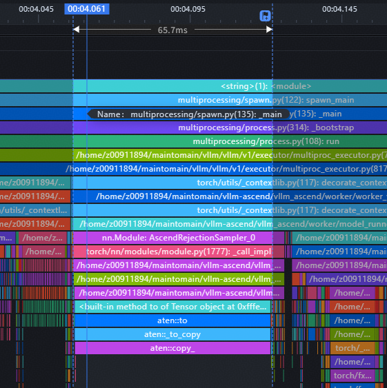

# 背景介绍

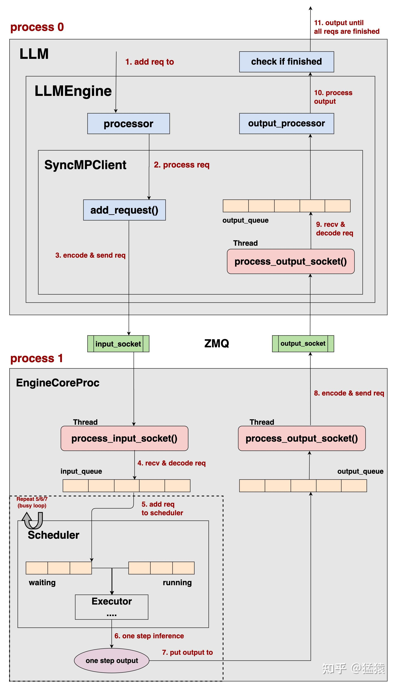
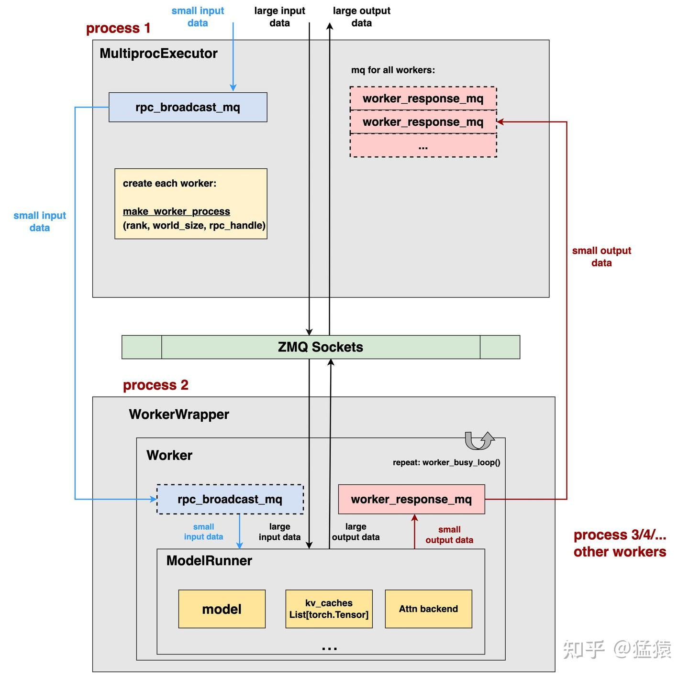

vllm的主体执行流程如上所示。
在EngineCore进程中，会存在一个loop循环。该循环重复做如下事情：

- 查看input_queue进程中是否有新请求，如果有新请求则添加到scheduler中，如果没有新请求，且已有请求处理完成，则阻塞等待，否则执行下一步
- 进行一步调度执行，得到模型推理结果

```python

def run_busy_loop(self):
        """Core busy loop of the EngineCore."""

        # Loop until process is sent a SIGINT or SIGTERM
        while True:
            # 1) Poll the input queue until there is work to do.
            self._process_input_queue()
            # 2) Step the engine core and return the outputs.
            self._process_engine_step()
            count += 1
```

进一步打开`_process_engine_step`进行分析，发现其核心执行的就一个`step_fn`。

```python
def _process_engine_step(self, count=0) -> bool:
        """Called only when there are unfinished local requests."""
        # logger.debug(f'_process_engine_step: {count}')
        # Step the engine core.
        outputs, model_executed = self.step_fn()
        # Put EngineCoreOutputs into the output queue.
        for output in (outputs.items() if outputs else ()):
            self.output_queue.put_nowait(output)

        return model_executed

```

`step_fn`有两个函数形式

```python
self.step_fn = (self.step if self.batch_queue is None else
                        self.step_with_batch_queue)

```

`self.step`是普通的顺序调度函数，` self.step_with_batch_queue`则是引入了最新的异步调度逻辑。

# 同步调度

普通调度的`调度->模型执行->执行结果处理`三个流程是串行处理，具体如下代码所示

```python
def step(self) -> tuple[dict[int, EngineCoreOutputs], bool]:
        """Schedule, execute, and make output.

        Returns tuple of outputs and a flag indicating whether the model
        was executed.
        """

        # Check for any requests remaining in the scheduler - unfinished,
        # or finished and not yet removed from the batch.
        if not self.scheduler.has_requests():
            return {}, False
        scheduler_output = self.scheduler.schedule()
        model_output = self.execute_model_with_error_logging(
            self.model_executor.execute_model,  # type: ignore
            scheduler_output)
        engine_core_outputs = self.scheduler.update_from_output(
            scheduler_output, model_output)  # type: ignore

        return (engine_core_outputs,
                scheduler_output.total_num_scheduled_tokens > 0)

```

调度流程图如下所示：
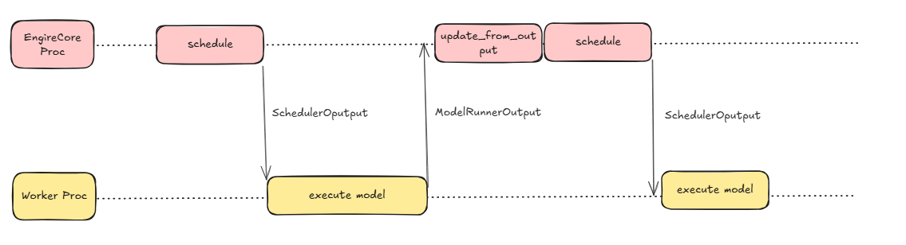

对应我们之前常见的profiling, 两次模型的执行`execute_model`之间会有一段纯cpu的调度逻辑处理，对应GPU/NPU侧会在两次decode间有一段空隙。

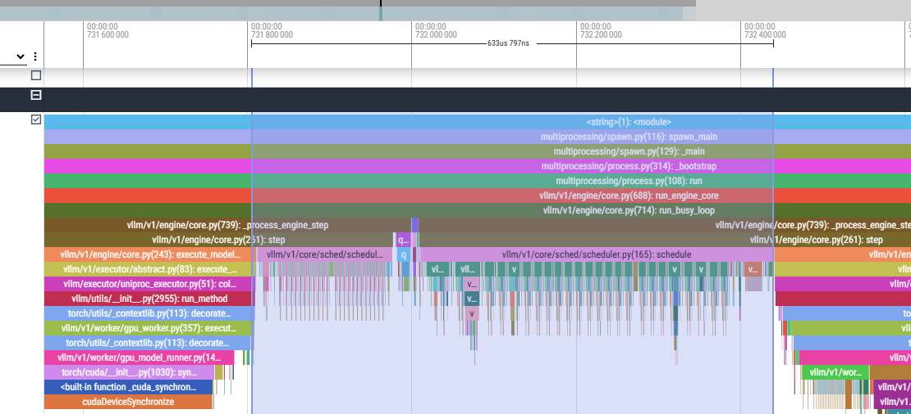

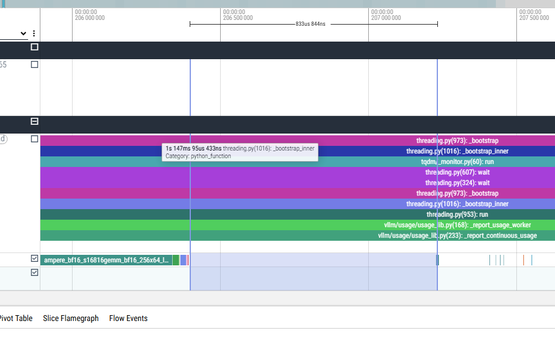

# 异步调度

两次模型的decode之间存在明显的空隙，vllm的PR https://github.com/vllm-project/vllm/pull/19970实现了异步调度。

```python
def step_with_batch_queue(
            self) -> tuple[Optional[dict[int, EngineCoreOutputs]], bool]:
        """Schedule and execute batches with the batch queue.
        Note that if nothing to output in this step, None is returned.

        The execution flow is as follows:
        1. Try to schedule a new batch if the batch queue is not full.
        If a new batch is scheduled, directly return an empty engine core
        output. In other words, fulfilling the batch queue has a higher priority
        than getting model outputs.
        2. If there is no new scheduled batch, meaning that the batch queue
        is full or no other requests can be scheduled, we block until the first
        batch in the job queue is finished.
        3. Update the scheduler from the output.
        """
        # async_execute_model = self.vllm_config.scheduler_config.async_execute_model
        assert self.batch_queue is not None
        # logger.debug(f'step with bath_queue.')
        engine_core_outputs = None
        scheduler_output = None
        # Try to schedule a new batch if the batch queue is not full, but
        # the scheduler may return an empty batch if all requests are scheduled.
        # Note that this is not blocking.
        if not self.batch_queue.full():
            scheduler_output = self.scheduler.schedule()
            # logger.debug(f"make schedule: {scheduler_output}")
            if scheduler_output.total_num_scheduled_tokens > 0:
                future = self.model_executor.execute_model(scheduler_output)
                # logger.debug(f'get future of execute_Model.')
                self.batch_queue.put_nowait(
                    (future, scheduler_output))  # type: ignore
            # else:
            #     logger.debug(f"total_num_scheduled_tokens is 0")
            #     future = self.model_executor.execute_model(None)
        # if async_execute_model:
        #     scheduled_batch = scheduler_output is not None
        # else:
        scheduled_batch = (scheduler_output is not None
                        and scheduler_output.total_num_scheduled_tokens > 0)

        # If no more requests can be scheduled and the job queue is not empty,
        # block until the first batch in the job queue is finished.
        # TODO(comaniac): Ideally we should peek the first batch in the
        # job queue to check if it's finished before scheduling a new batch,
        # but peeking the first element in a queue is not thread-safe,
        # so we need more work.
        if not scheduled_batch and not self.batch_queue.empty():
            # if async_execute_model and scheduler_output is not None and scheduler_output.total_num_scheduled_tokens == 0:
            #     logger.info("scheduled_batch with total_num_scheduled_tokens==0")
            #     return engine_core_outputs, scheduled_batch
            future, scheduler_output = self.batch_queue.get_nowait()
            logger.debug(f'start to get blocking result.')
            # Blocking until the first result is available.
            model_output = self.execute_model_with_error_logging(
                lambda _: future.result(), scheduler_output)
            # logger.debug(f'success to get blocking result.')
            self.batch_queue.task_done()
            engine_core_outputs = (self.scheduler.update_from_output(
                scheduler_output, model_output))
            # logger.debug(f'engine_core_outputs: {engine_core_outputs}')

        return engine_core_outputs, scheduled_batch

```

当设置了参数`async_scheduling`时，则会执行`step_with_batch_queue`函数，
异步调度的核心逻辑就是设置一个长度为2的queue，会在worker进程运行execute_model时，EngineCore进程还会进行下一步的调度处理。这样Worker进程两次execute_model之间的空隙会减少，能直接拿到调度的SchedulerOutput结果用于模型执行。

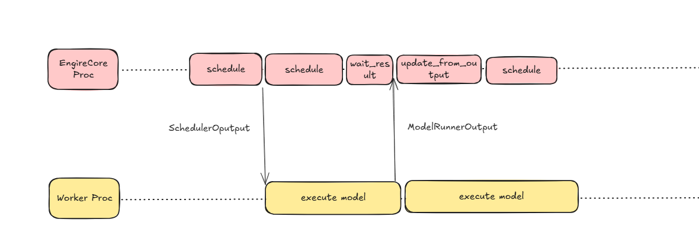

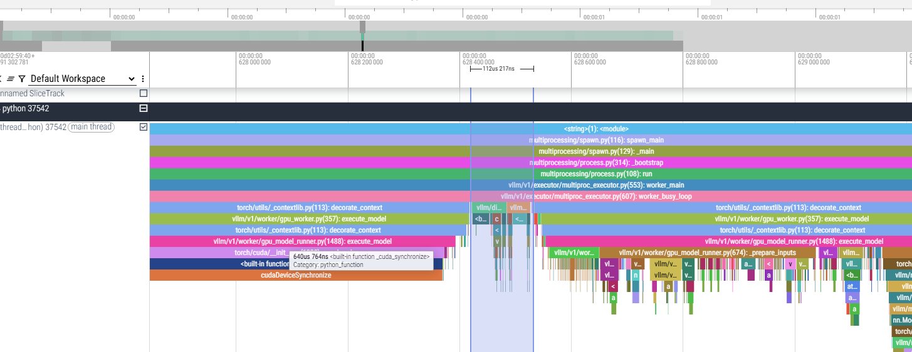

# 异步调度-d2h拷贝掩盖

vllm的异步调度已经能很大程度掩盖worker进程的两次execute_model之间空隙，但通过profiling结果可以发现，execute_model内部还有`update_states`和`prepare_input`的cpu侧操作，在这之后才会真正进入模型的forward阶段。

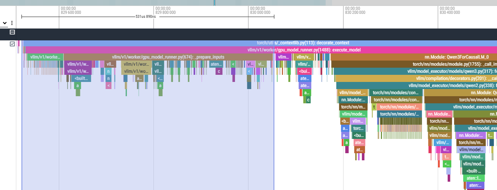
进一步，能够将`update_states`和`prepare_input`进行掩盖将能进一步减小deveice侧的空隙。

通过代码和profiling发现在execute_model中，最后sample出结果后，会将sample的结果从device拷贝到host侧，这是一个同步的过程。

代码如下

```python
# NOTE: GPU -> CPU Sync happens here.
        # Move as many CPU operations as possible before this sync point.
        logprobs_tensors = sampler_output.logprobs_tensors
        logprobs_lists = logprobs_tensors.tolists() \
            if logprobs_tensors is not None else None

        # Compute prompt logprobs if needed.
        prompt_logprobs_dict = self._get_prompt_logprobs_dict(
            hidden_states[:num_scheduled_tokens],
            scheduler_output,
        )

        # Get the valid generated tokens.
        sampled_token_ids = sampler_output.sampled_token_ids
        max_gen_len = sampled_token_ids.shape[-1]
        if max_gen_len == 1:
            # No spec decode tokens.
            valid_sampled_token_ids = sampled_token_ids.tolist() # tolist发生同步拷贝
        else:
            # Includes spec decode tokens.
            valid_sampled_token_ids = self.rejection_sampler.parse_output(
                sampled_token_ids,
                self.input_batch.vocab_size,
            )

```

对应profiling为

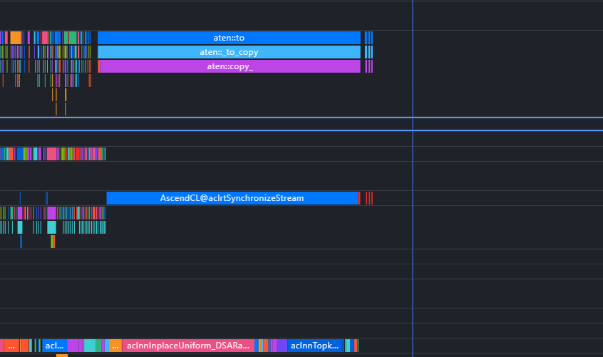
相应的流程为
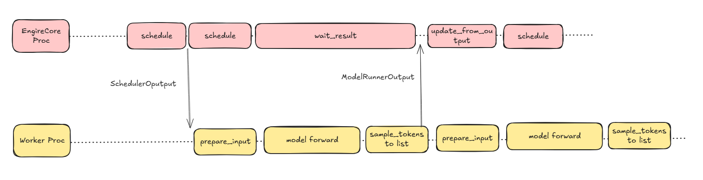

在d2h期间cpu线程是阻塞的，如果在此期间异步进行下一次execute_model的`update_state`和`prepare_input`部分cpu操作，则可以overlap掉这段同步操作，cpu可以继续执行。

vllm的PR https://github.com/vllm-project/vllm/pull/23569 实现了d2h的拷贝掩盖，掩盖完成后的流程如下图所示。
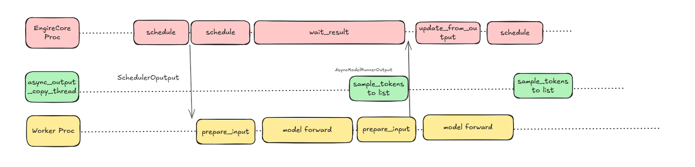

# 异步调度-投机解码

考虑投机解码使用的同步调度流程如下所示
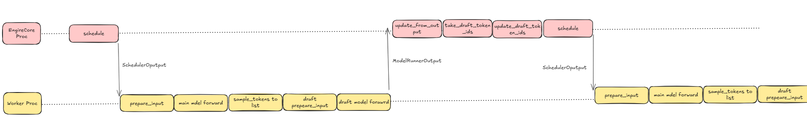
PR https://github.com/vllm-project/vllm/pull/24799实现投机解码的异步调度，异步调度的mtp流程为：

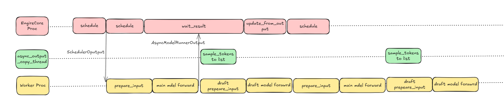

# prepare_input结构优化

## 当前现状

`InputBatch`中核心持久化变量图解：

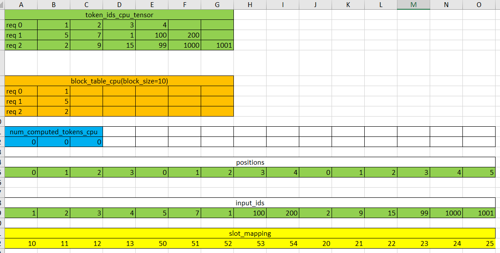

vllm在模型forward之前，涉及两个主要的数据准备操作：

- `_update_states`
- `_prepare_inputs`
  异步调度功能将cpu侧的调度操作掩盖在`execute_model`操作中，但`_update_states`和`_prepare_inputs`本身有大量的cpu操作以及少量的`AsyncMemCpy`算子下发，导致这段操作会出现明显的`HostBound`瓶颈。
  `_update_states`的具体操作如下所示:
  
  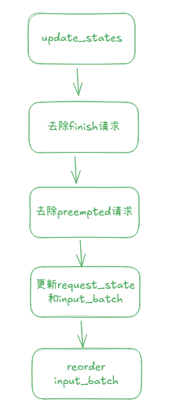
  `_prepare_inputs`的具体操作如下所示:
  
  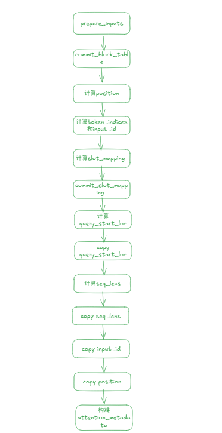
  
  ## model_runner_v2

https://github.com/vllm-project/vllm/issues/23446 vllm社区RFC提交了新的Persistent Batch数据结构设计, 有如下几个变化：

- 将原来的`InputBatch`和`CachedRequestState`修改为使用一个持久化的数据结构`RequestState`，从而消除重复状态的存储以及避免reorder的操作。
- 每个step都会基于`RequestState`生成·InputBatch`数据
- block table和slot mapping数据都是直接在GPU侧进行维护和计算。

model_runner_v2同样是在模型执行前有`_update_states`和`_prepare_inputs`两个数据准备操作。
`_update_states`的操作为：

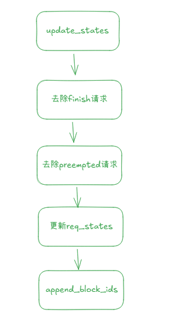
`_prepare_inputs`的操作为：

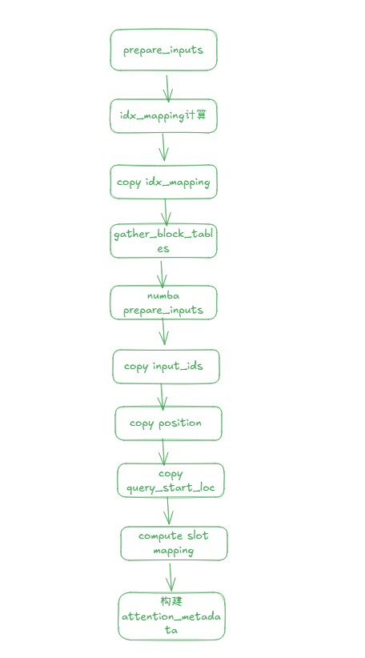

将`input_ids`，`positions`， `query_start_loc`，`seq_lens`等变量cpu侧的计算封装到一个`_prepare_inputs`函数中，并使用numba进行即时编译，相对于之前版本的分散调用python计算，能将cpu的计算速度提高至少一个数量级。

```python
# NOTE: With the type annotations, this function is pre-compiled
# before the first call.
@numba.jit(
    [
        types.none(
            types.int32[:],  # idx_mapping
            types.int32[:, :],  # token_ids
            types.int32[:],  # num_computed_tokens
            types.int32[:],  # num_scheduled_tokens
            types.int32[:],  # input_ids
            types.int64[:],  # positions
            types.int32[:],  # query_start_loc
            types.int32[:],  # seq_lens
        )
    ],
    nopython=True,
    cache=True,
)
def _prepare_inputs(
    idx_mapping: np.ndarray,  # batch_idx -> req_idx
    token_ids: np.ndarray,  # [N, max_model_len]
    num_computed_tokens: np.ndarray,  # [N]
    num_scheduled_tokens: np.ndarray,  # [B]
    input_ids: np.ndarray,  # [num_input_tokens]
    positions: np.ndarray,  # [num_input_tokens]
    query_start_loc: np.ndarray,  # [B + 1]
    seq_lens: np.ndarray,  # [B]
) -> None:
    num_reqs = num_scheduled_tokens.shape[0]
    query_start_loc[0] = 0

    cu_num_tokens = 0
    for i in range(num_reqs):
        req_idx = idx_mapping[i]
        query_len = num_scheduled_tokens[i]
        start = num_computed_tokens[req_idx]
        end = start + query_len
        seq_lens[i] = end

        start_idx = cu_num_tokens
        end_idx = start_idx + query_len
        input_ids[start_idx:end_idx] = token_ids[req_idx, start:end]
        positions[start_idx:end_idx] = np.arange(start, end, dtype=np.int64)

        cu_num_tokens = end_idx
        query_start_loc[i + 1] = cu_num_tokens

    # Pad the inputs for CUDA graphs.
    # Note: pad query_start_loc to be non-decreasing, as kernels
    # like FlashAttention requires that
    query_start_loc[num_reqs + 1 :].fill(cu_num_tokens)
    # Fill unused with 0 for full cuda graph mode.
    seq_lens[num_reqs:].fill(0)
```

## 投机解码的_prepare_input优化

vllm的PR https://github.com/vllm-project/vllm/pull/24539实现投机解码模型模型的执行不依赖cpu侧的sample  token，直接使用gpu侧的sample token。

```python
if self.speculative_config.disable_padded_drafter_batch:
    # When padded-batch is disabled, the sampled_token_ids should be
    # the cpu-side list[list[int]] of valid sampled tokens for each
    # request, with invalid requests having empty lists.
    assert isinstance(sampled_token_ids, list), (
        "sampled_token_ids should be a python list when"
        "padded-batch is disabled."
    )
    next_token_ids = self.drafter.prepare_next_token_ids_cpu(
        sampled_token_ids,
        self.requests,
        self.input_batch,
        scheduler_output.num_scheduled_tokens,
    )
else:
    # When using padded-batch, the sampled_token_ids should be
    # the gpu tensor of sampled tokens for each request, of shape
    # (num_reqs, num_spec_tokens + 1) with rejected tokens having
    # value -1.
    assert isinstance(sampled_token_ids, torch.Tensor), (
        "sampled_token_ids should be a torch.Tensor when"
        "padded-batch is enabled."
    )
    next_token_ids, valid_sampled_tokens_count = (
        self.drafter.prepare_next_token_ids_padded(
            common_attn_metadata,
            sampled_token_ids,
            self.requests,
            self.input_batch,
            self.discard_request_indices.gpu,
            self.num_discarded_requests,
        )
    )
```

其中`prepare_next_token_ids_padded`和`prepare_inputs_padded`相对于基于cpu侧的sample token操作，能较大程度减少投机解码模型的`prepare_input`的cpu操作时间。

## sglang的mtp调度掩盖

https://github.com/sgl-project/sglang/issues/11762

https://docs.google.com/presentation/d/1qHISwk09kL1QNoq6F-tQ6AyX63TokPyyVaJGbHRlh60/edit?slide=id.p#slide=id.p


